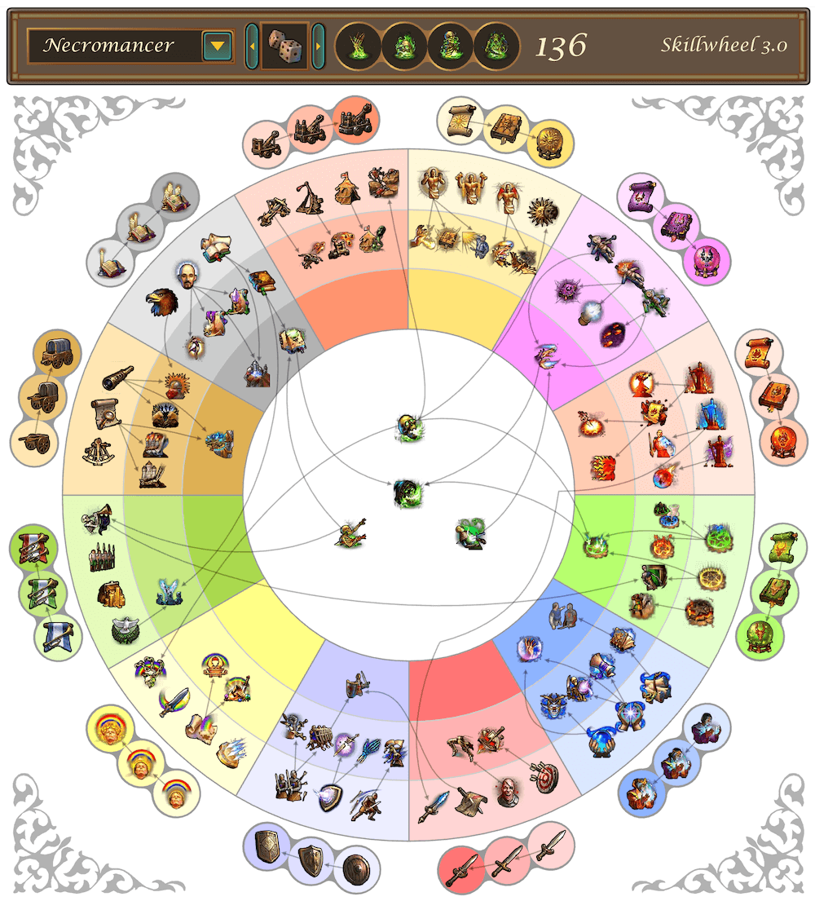

# Skillwheel for Heroes of Might & Magic V

This is a wrapper for the original app, making it available online with mobile devices support

## Credits
Aurelion: the original creator, his original post: https://www.celestialheavens.com/homam-v/general-hv/skill-wheel

Since the original app was built with Flash, the Ruffle emulator is used to make it available on modern devices. Check out Ruffle: https://ruffle.rs/

## To-Do
- [ ] hover support for skill details on iOS
