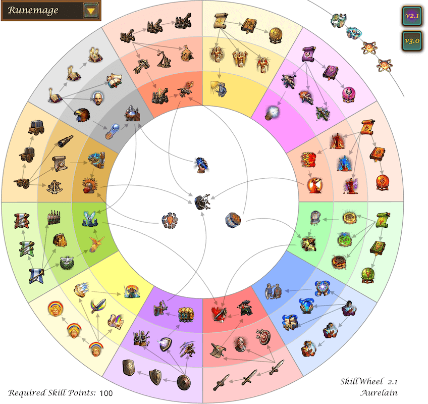

# Skillwheel for Heroes of Might & Magic V

 

This is a wrapper for Skillwheel v2.1 and v3.0. 
- Version 2.1 supports the original game, as well as the Hammers of Fate expansion
- Version 3.0 supports the Tribes of the East expansion

## Credits
Aurelion: the original creator. His original post: https://www.celestialheavens.com/homam-v/general-hv/skill-wheel

Since the original app was built with Flash, the Ruffle emulator is used to make it available in modern browsers. Check out Ruffle: https://ruffle.rs/

## To-Do
- [ ] mobile support
